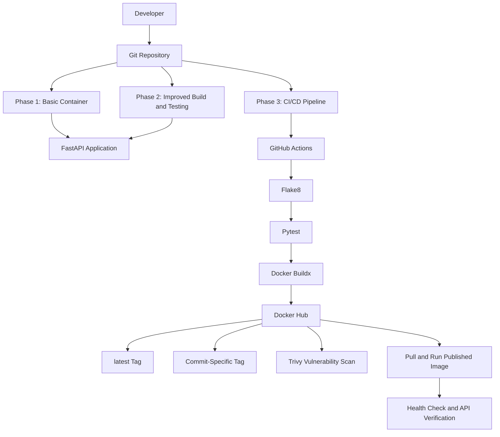
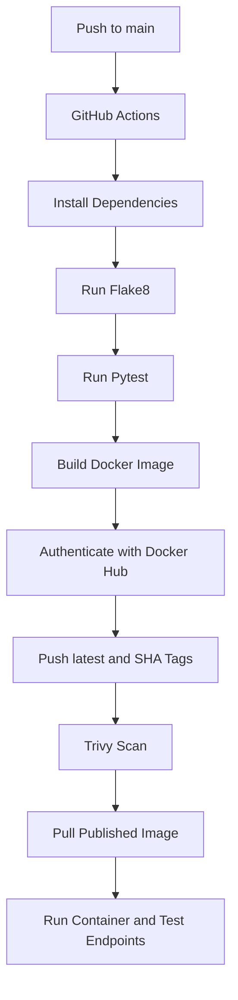

# Docker Mastery Project — From Fundamentals to CI/CD Automation

**A hands-on project exploring Docker, Python application containerization, automated testing, and CI/CD with GitHub Actions.**

This repository documents my practical journey through three stages of Docker development: starting with a simple containerized API, improving the image build and testing process, and finally automating Docker image publishing through a CI/CD pipeline.

The goal is to understand not only how to run an application inside a container, but also how to build it consistently, validate changes automatically, publish versioned images, and verify that the published application works.

---

## Table of Contents

- [Project Overview](#project-overview)
- [Project Goals](#project-goals)
- [Architecture](#architecture)
- [Three-Phase Roadmap](#three-phase-roadmap)
- [Technology Stack](#technology-stack)
- [Repository Structure](#repository-structure)
- [Prerequisites](#prerequisites)
- [Getting Started](#getting-started)
- [Phase 1 — Docker Fundamentals](#phase-1--docker-fundamentals)
- [Phase 2 — Intermediate Docker](#phase-2--intermediate-docker)
- [Phase 3 — Advanced Docker and CI/CD](#phase-3--advanced-docker-and-cicd)
- [API Endpoints](#api-endpoints)
- [CI/CD Pipeline](#cicd-pipeline)
- [Docker Hub Images](#docker-hub-images)
- [Security and Reliability](#security-and-reliability)
- [Troubleshooting](#troubleshooting)
- [Key Learnings](#key-learnings)
- [Future Improvements](#future-improvements)
- [Project Links](#project-links)

## Project Overview

Docker is useful for packaging applications and their dependencies into a consistent environment. However, creating a container is only one part of a reliable delivery process.

This project explores how the process can evolve through three phases:

1. **Beginner:** Build and run a basic FastAPI application inside a Docker container.
2. **Intermediate:** Improve the image build process, organize dependencies, and introduce automated testing and code-quality checks.
3. **Advanced:** Integrate GitHub Actions with Docker Hub to automate validation, image building, publishing, and vulnerability reporting.

Each phase builds on the previous one. The application remains relatively small so that the focus stays on Docker concepts, build practices, automation, and troubleshooting rather than unnecessary application complexity.

### Project at a glance

| Item | Details |
|---|---|
| Project name | Docker Mastery Project |
| Application | FastAPI REST API |
| Programming language | Python |
| Container platform | Docker |
| CI/CD platform | GitHub Actions |
| Image registry | Docker Hub |
| Automated testing | Pytest |
| Code quality | Flake8 |
| Security scanning | Trivy |
| Development environment | WSL 2 and Docker Desktop |
| Project status | Three phases implemented; Phase 3 image publishing verified |

## Project Goals

The main goals of this project are to:

- Understand Docker images, containers, ports, and container lifecycle management.
- Package a Python API into a reproducible container.
- Improve Dockerfiles through multi-stage builds and cleaner dependency management.
- Separate application dependencies from development and testing tools.
- Introduce automated tests and linting into the development workflow.
- Configure GitHub Actions to run validation whenever code changes.
- Publish Docker images to Docker Hub using meaningful tags.
- Use Trivy to identify known vulnerabilities in container images.
- Troubleshoot real issues involving credentials, Git synchronization, Docker networking, and host-port conflicts.
- Establish a foundation for future cloud deployment and infrastructure automation.

## Architecture

The project follows a progression from local container execution to automated image delivery.

### Overall project architecture



The diagram represents the main concepts across the project. Phase 1 focuses on local execution, Phase 2 introduces better build and testing practices, and Phase 3 connects these practices to an automated publishing workflow.

### Phase 3 delivery flow



The test job is a prerequisite for the publishing job. A failed test job prevents the dependent image build and publishing job from proceeding.

## Three-Phase Roadmap

<details>
<summary><strong>Phase 1 — Beginner: Docker Fundamentals</strong></summary>

The first phase establishes the foundation for working with containers.

**Key activities**

- Created a basic FastAPI application.
- Wrote a Dockerfile to package the application.
- Built a Docker image locally.
- Started a container and exposed the application on port `8000`.
- Tested the API using browser requests and command-line tools.
- Practiced viewing container status, logs, and health information.

**Main learning outcome:** Understanding the relationship between the application, Docker image, running container, and host port mapping.

</details>

<details>
<summary><strong>Phase 2 — Intermediate: Better Builds and Testing</strong></summary>

The second phase improves the application build process and introduces automated validation.

**Key activities**

- Used a Python slim base image.
- Introduced a multi-stage Docker build.
- Organized runtime and development dependencies.
- Added `.dockerignore` to reduce unnecessary build context.
- Added Pytest tests and Flake8 code-quality checks.
- Maintained a GitHub Actions CI workflow for validation.

**Main learning outcome:** Moving from a manually built container to a more organized and repeatable development process.

</details>

<details>
<summary><strong>Phase 3 — Advanced: Docker CI/CD and Publishing</strong></summary>

The third phase connects testing, container building, image publishing, and vulnerability reporting.

**Key activities**

- Used a multi-stage Alpine-based Docker build.
- Configured the application to run under a non-root user.
- Added container health-check support.
- Automated linting and testing using GitHub Actions.
- Configured Docker Hub authentication through GitHub repository secrets.
- Published the image with `latest` and commit-specific tags.
- Added Trivy vulnerability reporting.
- Pulled the published image and tested it locally.

**Main learning outcome:** Automating the delivery of a validated, version-identifiable container image and verifying the published artifact.

</details>

## Technology Stack

| Technology | How it is used |
|---|---|
| Python | Implements the API application |
| FastAPI | Defines the HTTP endpoints |
| Uvicorn | Runs the FastAPI application |
| Docker | Builds and runs containers |
| Docker Buildx | Supports the automated image build |
| Git | Tracks source changes and commits |
| GitHub | Hosts the project repository |
| GitHub Actions | Automates validation and publishing |
| Docker Hub | Stores and distributes container images |
| Pytest | Runs automated tests |
| Flake8 | Checks Python code quality |
| Trivy | Reports known container vulnerabilities |
| WSL 2 | Provides the Linux development environment |
| Docker Desktop | Runs Docker in the local development setup |

## Repository Structure

The repository is organized by phase so that each stage can be explored independently.

```text
docker-mastery-project/
│
├── .github/
│   └── workflows/
│       ├── ci.yml
│       └── phase3-ci-cd.yml
│
├── phase1-beginner/
│   ├── app/
│   ├── Dockerfile
│   ├── requirements.txt
│   └── README.md
│
├── phase2-intermediate/
│   ├── app/
│   ├── Dockerfile
│   ├── .dockerignore
│   ├── requirements.txt
│   ├── requirements-dev.txt
│   ├── test_main.py
│   └── README.md
│
├── phase3-advanced/
│   ├── app/
│   │   └── main.py
│   ├── Dockerfile
│   ├── requirements.txt
│   ├── requirements-dev.txt
│   ├── test_main.py
│   └── README.md
│
└── README.md
```

The structure above illustrates the intended organization of the repository. Check the actual directory names and files in your GitHub repository before using this tree verbatim, particularly for the Phase 1 directory and its documentation.

### Important files

- `Dockerfile` — defines how the application image is built.
- `requirements.txt` — lists the application's runtime dependencies.
- `requirements-dev.txt` — lists development and testing dependencies.
- `test_main.py` — contains the automated tests.
- `.dockerignore` — excludes unnecessary files from the Docker build context.
- `ci.yml` — the separate CI workflow.
- `phase3-ci-cd.yml` — the advanced validation, publishing, and scanning workflow.
- `README.md` — documents the project and instructions for using it.

## Prerequisites

Install the following tools before running the project:

- Docker Desktop with WSL 2 integration enabled, or a working Docker Engine installation.
- Git.
- Python 3 and `pip` for local development and testing.
- A GitHub account to host the source code and run Actions.
- A Docker Hub account if you want to publish your own images.

Verify the local environment:

```bash
docker --version
docker info
git --version
python3 --version
```

Docker commands should work from your WSL terminal after Docker Desktop has started.

## Getting Started

### 1. Clone the repository

```bash
git clone https://github.com/srinivasupolamuri/docker-mastery-project.git
cd docker-mastery-project
```

### 2. Explore the phases

```bash
ls
```

Move into the required phase directory. For example:

```bash
cd phase3-advanced
```

### 3. Build the Phase 3 image

From the repository root:

```bash
docker build -t docker-mastery-demo:local ./phase3-advanced
```

### 4. Run the container

```bash
docker run -d \
  --name phase3-local \
  -p 8000:8000 \
  docker-mastery-demo:local
```

The application should now be available at `http://localhost:8000`.

If the host port is already in use, map port `8001` to the container's port `8000`:

```bash
docker run -d \
  --name phase3-local \
  -p 8001:8000 \
  docker-mastery-demo:local
```

The alternative URL is `http://localhost:8001`.

### 5. Verify the running container

```bash
docker ps
docker logs phase3-local
```

Check the application health endpoint:

```bash
curl http://localhost:8000/health
```

Use port `8001` in the URL if you selected the alternative mapping.

### 6. Stop and remove the container

```bash
docker rm -f phase3-local
```

Removing a container does not delete the Docker image. The image can be reused to start another container.

## Phase 1 — Docker Fundamentals

Phase 1 introduces the basic Docker workflow: creating an application, building its image, running the container, and verifying the API.

The application exposes endpoints such as `/`, `/health`, and `/info`.

### Build and run

Use the Dockerfile and instructions in the Phase 1 directory:

```bash
docker build -t docker-devops:phase1 ./phase1-beginner
```

```bash
docker run -d \
  --name phase1-app \
  -p 8000:8000 \
  docker-devops:phase1
```

These commands assume the Phase 1 directory is named `phase1-beginner` and contains the corresponding Dockerfile.

### What this phase demonstrates

- Basic Dockerfile instructions.
- Image creation and container execution.
- Port mapping between host and container.
- Container logs and lifecycle management.
- HTTP endpoint verification.

## Phase 2 — Intermediate Docker

Phase 2 focuses on improving the container build and introducing automated code validation.

The Docker build uses a Python slim base image and a multi-stage approach. Development dependencies are kept separate from runtime dependencies, and `.dockerignore` helps avoid copying unnecessary local files into the build context.

### Build and run

From the repository root:

```bash
docker build -t docker-mastery:phase2 ./phase2-intermediate
```

```bash
docker run -d \
  --name phase2-app \
  -p 8000:8000 \
  docker-mastery:phase2
```

If port `8000` is occupied, use `-p 8001:8000`.

### Run tests and lint checks

Install the dependencies from the Phase 2 directory:

```bash
python3 -m pip install -r phase2-intermediate/requirements.txt
python3 -m pip install -r phase2-intermediate/requirements-dev.txt
```

Run the checks:

```bash
python3 -m pytest -q phase2-intermediate/test_main.py
python3 -m flake8 phase2-intermediate/app phase2-intermediate/test_main.py
```

These commands assume the required Python packages are installed in the active environment.

### What this phase demonstrates

- Multi-stage Docker builds.
- Better separation of runtime and development dependencies.
- Build-context optimization.
- Automated testing and linting.
- Continuous integration using GitHub Actions.

## Phase 3 — Advanced Docker and CI/CD

Phase 3 is the current advanced stage of the project. It connects code validation with image publication and vulnerability reporting.

### Workflow stages

1. Check out the source code.
2. Set up Python.
3. Install application and development dependencies.
4. Run Flake8.
5. Run Pytest.
6. Build the Docker image using Buildx.
7. Authenticate with Docker Hub.
8. Publish the image under two tags.
9. Scan the published image with Trivy.

The workflow is maintained in:

```text
.github/workflows/phase3-ci-cd.yml
```

### Image tags

The pipeline publishes:

```text
srini9808/docker-mastery-demo:latest
srini9808/docker-mastery-demo:sha-<commit-sha>
```

The `latest` tag is convenient for local testing. The commit-specific tag helps identify the source revision associated with a published image.

### Pull and run the published image

Pull the image:

```bash
docker pull srini9808/docker-mastery-demo:latest
```

Run it:

```bash
docker run -d \
  --name docker-mastery-test \
  -p 8001:8000 \
  srini9808/docker-mastery-demo:latest
```

Verify it:

```bash
docker ps
curl http://localhost:8001/health
curl http://localhost:8001/info
```

The host port is set to `8001` here to avoid conflicts with existing containers. Use `docker logs docker-mastery-test` if the application does not respond as expected.

### Docker Hub

The image repository is available at:

**Image repository:** https://hub.docker.com/r/srini9808/docker-mastery-demo

**Published tags:** https://hub.docker.com/r/srini9808/docker-mastery-demo/tags

### GitHub Actions secrets

The Phase 3 workflow uses the following GitHub repository secrets:

| Secret | Purpose |
|---|---|
| `DOCKERHUB_USERNAME` | Docker Hub account username |
| `DOCKERHUB_TOKEN` | Docker Hub personal access token with Read & Write permissions |

The workflow accesses these values through GitHub's `secrets` context. Credentials should never be committed to the repository.

### Security scanning

Trivy scans the published image for known operating-system and library vulnerabilities.

The current workflow uses `exit-code: '0'`, which means vulnerability findings are reported without automatically failing the pipeline. This is useful for an initial reporting stage, but it is not equivalent to enforcing a strict security policy.

A future improvement is to introduce an explicit severity and fixability policy and make the workflow fail when the defined conditions are met.

## API Endpoints

The FastAPI application exposes the following endpoints.

| Endpoint | Method | Purpose |
|---|---|---|
| `/` | GET | Returns the main application response |
| `/health` | GET | Checks whether the application is responding |
| `/info` | GET | Returns application information |
| `/docs` | GET | Opens the interactive Swagger UI documentation |

Example requests:

```bash
curl http://localhost:8000/
curl http://localhost:8000/health
curl http://localhost:8000/info
```

For interactive API testing, open:

`http://localhost:8000/docs`

Use the mapped host port if the application is running on a different port.

## CI/CD Pipeline

The Phase 3 GitHub Actions workflow supports pushes to `main`, pull requests targeting `main`, and manual execution.

### Pull requests

The workflow validates the code through the lint and test job. It does not publish a Docker image for a pull request.

### Pushes to main

After a successful test job, the publishing job builds the image, authenticates with Docker Hub, pushes both tags, and runs the Trivy scan.

### Manual execution

The workflow can also be triggered from the GitHub repository's **Actions** tab using the **Run workflow** option.

### Reviewing workflow results

To inspect a run:

1. Open the GitHub repository.
2. Select **Actions**.
3. Open the relevant Phase 3 workflow run.
4. Review the lint, test, build, push, and scan logs.

A successful publishing job confirms that the workflow completed its Docker image publishing steps. The separate local pull-and-run test verifies that the published artifact can also be executed.

## Security and Reliability

The project includes several practices that help make container workflows more reliable:

- Automated tests before image publishing.
- Lint checks for Python code quality.
- Separate runtime and development dependencies.
- GitHub Secrets for Docker Hub credentials.
- Commit-specific tags for image traceability.
- Container health-check support in Phase 3.
- Vulnerability reporting through Trivy.
- Documented container startup and troubleshooting procedures.

The project is a learning implementation rather than a fully hardened production deployment. Additional security controls, deployment policies, and monitoring can be introduced as the project evolves.

## Troubleshooting

### Docker reports that port 8000 is already allocated

Check which containers are running:

```bash
docker ps
```

Stop and remove a container only if it is no longer needed:

```bash
docker rm -f <container-name>
```

Alternatively, use a different host port:

```bash
docker run -d \
  --name phase3-test \
  -p 8001:8000 \
  docker-mastery-demo:local
```

### Docker Hub reports insufficient token scopes

Create a Docker Hub personal access token with Read & Write permissions and update the `DOCKERHUB_TOKEN` GitHub repository secret.

Confirm that the username and token belong to the correct Docker Hub account.

### Git rejects a push

If the remote branch contains commits that are not present locally, synchronize before pushing:

```bash
git pull --rebase origin main
git push origin main
```

Resolve any conflicts before proceeding. Avoid force-pushing when the remote history needs to be preserved.

### Docker pull fails because of the local credential helper

If Docker Desktop or WSL reports a credential-helper error while pulling a public image, restart Docker Desktop and WSL if necessary.

For a public image, a temporary Docker configuration can be used:

```bash
mkdir -p /tmp/docker-config-clean

DOCKER_CONFIG=/tmp/docker-config-clean \
docker pull srini9808/docker-mastery-demo:latest
```

This bypasses the saved credential configuration for that command without changing the GitHub Actions secrets.

### Container starts but the application does not respond

Check its state and logs:

```bash
docker ps -a
docker logs <container-name>
```

Verify that the application is listening on the expected container port and that the host-to-container port mapping is correct.

## Key Learnings

Working through these three phases provided practical experience with more than just Docker commands.

The project helped me understand how to:

- Build and run containerized Python applications.
- Improve Dockerfiles using multi-stage builds.
- Separate runtime dependencies from development tools.
- Integrate linting and automated tests into a workflow.
- Build Docker images through GitHub Actions.
- Authenticate to Docker Hub securely using repository secrets.
- Publish images with traceable tags.
- Scan images for known vulnerabilities.
- Troubleshoot real issues involving Git, credentials, and container networking.
- Validate a published image independently of the local build.

The main takeaway is that containerization is only one part of the delivery process. Reliable automation also requires validation, consistent image tagging, secure authentication, and runtime verification.

## Future Improvements

The next stage of the project can extend the existing pipeline into cloud deployment and operations.

Planned enhancements include:

- Automated deployment of the published image to AWS EC2.
- Deployment triggered by a successful CI/CD run.
- Health checks after deployment.
- Rollback handling if a new release fails.
- More restrictive Trivy vulnerability policies.
- Pinning third-party GitHub Actions to verified commit SHAs.
- Environment-specific configuration and secrets management.
- Deployment status reporting and operational documentation.
- Infrastructure provisioning with Terraform.
- Configuration and deployment automation with Ansible.

These are future enhancements; they should be considered complete only after implementation and testing.

## Project Links

- **GitHub source code:** https://github.com/srinivasupolamuri/docker-mastery-project
- **Docker Hub image:** https://hub.docker.com/r/srini9808/docker-mastery-demo
- **Docker Hub tags:** https://hub.docker.com/r/srini9808/docker-mastery-demo/tags

---

**Project:** Docker Mastery Project

**Focus:** Docker fundamentals, multi-stage builds, automated testing, CI/CD, container image publishing, and vulnerability reporting.

*Built as a practical, phased learning project to develop hands-on experience with containerization and DevOps automation.*
