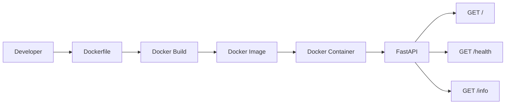

# 🐳 Phase 1 — Beginner: Basic Dockerized FastAPI Application

> A beginner-friendly Docker implementation of a FastAPI application using an Ubuntu base image and a single-stage Docker build.

## 📌 Overview

Phase 1 establishes the foundation of Docker by taking a small FastAPI application and packaging it into a Docker container.

The goal is to understand the complete basic Docker workflow:

```text
Application
    ↓
Dockerfile
    ↓
Docker Build
    ↓
Docker Image
    ↓
Docker Run
    ↓
Docker Container
    ↓
FastAPI API
```

This phase intentionally uses `ubuntu:22.04` as the base image and installs Python and application dependencies manually. It is designed for learning Docker fundamentals rather than maximum image optimization.

---

## 🎯 Learning Objectives

By completing Phase 1, you should understand:

- What a Docker image is
- What a Docker container is
- How a Dockerfile works
- Docker build context
- `FROM`, `ENV`, `RUN`, `WORKDIR`, `COPY`, `EXPOSE`, and `CMD`
- Installing application dependencies inside an image
- Mapping container ports to the host
- Starting, stopping, inspecting, and removing containers
- Testing a containerized API

---

## 🏗️ Application Architecture



---

## 📁 Project Structure

```text
phase1-beginner/
│
├── app/
│   └── main.py
│
├── Dockerfile
├── .dockerignore
├── requirements.txt
├── requirements-dev.txt
├── test_main.py
└── README.md
```

### File responsibilities

| File | Purpose |
|---|---|
| `app/main.py` | FastAPI application |
| `Dockerfile` | Defines the container image |
| `.dockerignore` | Excludes unnecessary files from Docker build context |
| `requirements.txt` | Runtime Python dependencies |
| `requirements-dev.txt` | Development/testing dependencies |
| `test_main.py` | Automated API tests |
| `README.md` | Phase documentation |

---

# 🧰 Technology Stack

- Python 3.12
- FastAPI `0.111.0`
- Uvicorn `0.30.1`
- Pytest
- Docker
- Ubuntu 22.04
- Git/GitHub

---

# 📋 Prerequisites

Verify your tools:

```bash
python3 --version
docker --version
git --version
```

Verify Docker is running:

```bash
docker run hello-world
```

---

# 1️⃣ Run the Application Locally

From the Phase 1 directory:

```bash
cd ~/docker-mastery-project/phase1-beginner
```

Create a virtual environment:

```bash
python3 -m venv venv
```

Activate it:

```bash
source venv/bin/activate
```

Install runtime dependencies:

```bash
pip install -r requirements.txt
```

Install development dependencies:

```bash
pip install -r requirements-dev.txt
```

---

# 2️⃣ Run Automated Tests

Run:

```bash
pytest
```

The test suite validates:

- `/`
- `/health`
- `/info`
- HTTP status codes
- Expected JSON fields

Expected result:

```text
3 passed
```

> Dependency warnings may appear depending on the installed Python/package versions. A successful test result is the important validation for this phase.

---

# 3️⃣ Understand the Dockerfile

The Phase 1 Dockerfile follows a simple single-stage approach:

```dockerfile
FROM ubuntu:22.04

ENV DEBIAN_FRONTEND=noninteractive

RUN apt-get update && apt-get install -y --no-install-recommends \
    python3 \
    python3-pip \
    && rm -rf /var/lib/apt/lists/*

WORKDIR /app

COPY requirements.txt .

RUN pip3 install --no-cache-dir -r requirements.txt

COPY app/ ./app

EXPOSE 8000

CMD ["python3", "-m", "uvicorn", "app.main:app", "--host", "0.0.0.0", "--port", "8000"]
```

### Dockerfile instruction breakdown

| Instruction | Purpose |
|---|---|
| `FROM` | Selects the base image |
| `ENV` | Sets environment configuration |
| `RUN` | Executes commands during image build |
| `WORKDIR` | Sets the working directory |
| `COPY` | Copies files into the image |
| `EXPOSE` | Documents the application port |
| `CMD` | Defines the default startup command |

---

# 4️⃣ Build the Docker Image

Run:

```bash
docker build -t docker-mastery:phase1 .
```

Verify:

```bash
docker images
```

You should see an image similar to:

```text
docker-mastery   phase1
```

Inspect the image:

```bash
docker image inspect docker-mastery:phase1
```

---

# 5️⃣ Run the Container

Start the application:

```bash
docker run -d \
  --name phase1-app \
  -p 8000:8000 \
  docker-mastery:phase1
```

Explanation:

```text
-p 8000:8000
   │     │
   │     └── Container port
   └──────── Host port
```

---

# 6️⃣ Verify the Container

List running containers:

```bash
docker ps
```

View logs:

```bash
docker logs phase1-app
```

Follow logs:

```bash
docker logs -f phase1-app
```

Press `Ctrl+C` to stop following logs.

---

# 7️⃣ Test the API

### Root endpoint

```bash
curl http://localhost:8000/
```

### Health endpoint

```bash
curl http://localhost:8000/health
```

### Information endpoint

```bash
curl http://localhost:8000/info
```

The API exposes three simple endpoints for validating the containerized service.

---

# 8️⃣ Container Lifecycle

Stop:

```bash
docker stop phase1-app
```

Start the same container again:

```bash
docker start phase1-app
```

Remove the container:

```bash
docker stop phase1-app
docker rm phase1-app
```

The image remains available unless you explicitly remove it.

---

# 🔍 Useful Docker Inspection Commands

List all containers:

```bash
docker ps -a
```

Inspect the container:

```bash
docker inspect phase1-app
```

Inspect the image:

```bash
docker image inspect docker-mastery:phase1
```

View image history:

```bash
docker history docker-mastery:phase1
```

---

# 📊 Phase 1 Characteristics

| Area | Phase 1 |
|---|---|
| Base image | Ubuntu 22.04 |
| Build type | Single-stage |
| Python installation | Manual |
| Runtime image | Full Ubuntu-based environment |
| Non-root user | Not yet implemented |
| Health check | Not yet implemented |
| Multi-stage build | No |
| CI/CD | Foundation for later phases |
| Main goal | Learn Docker fundamentals |

---

# 🧠 What Phase 1 Teaches

Phase 1 answers the fundamental question:

> **How do I package and run an application inside Docker?**

You learn the relationship between:

```text
Dockerfile → Image → Container → Application
```

This is the foundation for the optimization and security improvements introduced in the following phases.

---

# 🖼️ Recommended Presentation Screenshots

Create a folder such as:

```text
images/
├── docker-intro.png
├── docker-build-phase1.png
├── docker-images-phase1.png
├── phase1-container-running.png
├── phase1-api-test.png
└── phase1-tests.png
```

Recommended evidence to capture:

### Docker image

```bash
docker images
```

### Running container

```bash
docker ps
```

### API

```bash
curl http://localhost:8000/
curl http://localhost:8000/health
curl http://localhost:8000/info
```

### Tests

```bash
pytest
```

---

# ⚠️ Limitations

This phase intentionally prioritizes learning simplicity over production optimization.

The main limitations are:

- Larger base image
- Single-stage build
- Build/runtime concerns are not separated
- Container does not explicitly use a non-root user
- No Docker health check
- No advanced image hardening

These limitations are intentional because they provide a baseline for comparison with Phase 2 and Phase 3.

---

# 🚀 Next Step

Continue to:

**[Phase 2 — Intermediate](../phase2-intermediate/README.md)**

Phase 2 introduces:

- Python Slim
- Multi-stage builds
- Better dependency separation
- Automated CI validation
- Image optimization concepts

